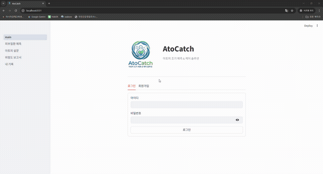

# AtoCatch 🌿
**AI 기반 피부 이미지 아토피 조기 예측 및 케어 솔루션**

> 피부 사진 업로드 + 생활습관 문진 → 5종 피부 질환 분류 & 아토피 위험도 분석 → 맞춤형 보고서 제공



---

## 프로젝트 개요

아토피 피부염은 국내 환자 수 약 97만 명(2024)에 달하는 만성 질환으로, 성인 유병률이 2008년 대비 2.6배 증가했습니다. 기존 진단은 병원 방문과 전문의 대면 평가에 의존하여 일상적 조기 스크리닝이 어렵다는 한계가 있습니다.

AtoCatch는 두 가지 AI 모델을 결합해 이 문제를 해결합니다.

1. **이미지 분류 모델** — 피부 사진으로 5종 질환(정상/아토피/건선/여드름/주사)을 분류
2. **문진형 위험도 모델** — KNHANES 건강 설문 데이터 기반으로 아토피 발병 위험 요인 분석

---

## 주요 성능

| 평가셋 | Accuracy | Macro F1 |
|--------|----------|----------|
| AI Hub 테스트 (합성 이미지, 600장) | 99.60% | 0.9960 |
| DermNet 테스트 (실제 이미지, ~323장) | 94.43% | 0.9486 |
| 전체 합산 | 97.57% | 0.9794 |

| 문진 모델 | ROC-AUC | PR-AUC |
|----------|---------|--------|
| Logistic Regression (class_weight=balanced) | 0.786 | 0.3275 |

### 🧪 추가 실험: DermNet 아토피 클래스 정제 (v4, 미채택)

DermNet "Atopic Dermatitis Photos" 폴더에 keratosis·ichthyosis 등 혼입 이미지가 섞여 있어, 파일명에 `atopic`이 포함된 이미지만 남기고 재학습을 시도했습니다 (`image_model/experiments/`).

| 버전 | 실사 이미지 스팟체크 정확도 |
|------|------------------------------|
| v3 (현재 채택 모델) | **52.0%** |
| v4 (아토피 클래스 정제) | **44.0%** |

정제된 데이터로 학습했음에도 실제 사진 테스트에서 오히려 성능이 하락해 **미채택**했습니다. 코드와 결과는 재현·참고용으로 남겨둡니다.

---

## 레포지토리 구조

```
AtoCatch/
│
├── image_model/                     # 이미지 분류 파이프라인
│   ├── 01_image_preprocess.py       # AI Hub + DermNet 데이터 전처리 및 300px 리사이즈
│   ├── 02_image_model_compare.py    # 후보 모델 비교 (EfficientNetV2-S 외 4종, 10 epoch)
│   ├── 03_image_tune_optuna.py      # Optuna 하이퍼파라미터 자동 탐색 (30 trial)
│   ├── 04_image_train.py            # 최적 HP 적용 풀학습 (20 epoch, warmup + cosine)
│   ├── 05_image_evaluate.py         # 최종 테스트 평가 (AI Hub / DermNet / 전체)
│   └── experiments/                 # DermNet 아토피 정제 실험 (v4, 미채택)
│       ├── preprocess_v2.py         # DermNet 아토피 클래스 정제 전처리
│       ├── train_mixed_v4.py        # v4 재학습
│       ├── evaluate_test_mixed_v4.py
│       ├── test_real.py             # 실사 이미지 스팟체크 (v3 기준)
│       └── test_real_v4.py          # 실사 이미지 스팟체크 (v4)
│
├── survey_model/                    # 문진형 아토피 위험도 파이프라인
│   ├── 01_survey_eda_modeling.py    # KNHANES EDA, 전처리, 로지스틱 회귀 분석
│   ├── 02_survey_tune_cv.py         # 5-Fold CV 하이퍼파라미터 튜닝 (LogReg/RF/LightGBM/MLP)
│   └── 03_survey_select_retrain.py  # Best 모델 선정 → 재학습 → 테스트 평가 + 캘리브레이션
│
├── app/                             # Streamlit 웹 애플리케이션
│   ├── main.py                      # 진입점 (로그인 / 회원가입)
│   ├── pages/
│   │   ├── 1_피부질환_예측.py        # 이미지 업로드 및 질환 예측
│   │   ├── 2_아토피_설문.py          # 7문항 생활습관 설문
│   │   ├── 3_위험도_보고서.py        # 종합 보고서 (HTML 다운로드 포함)
│   │   └── 4_내_기록.py             # 기록 히스토리 및 추이 그래프
│   └── utils/
│       ├── predict.py               # EfficientNetV2-S 추론 래퍼
│       ├── atopy_model.py           # 문진 모델 추론 + 위험 요인 산출
│       ├── db.py                    # SQLite CRUD (users / records)
│       ├── style.py                 # 전역 CSS 스타일
│       └── survey.py                # 설문 항목 정의
│
└── README.md
```

---

## 기술 스택

| 분류 | 라이브러리 |
|------|-----------|
| 딥러닝 | PyTorch, timm (EfficientNetV2-S) |
| 머신러닝 | scikit-learn, LightGBM, imbalanced-learn |
| 하이퍼파라미터 튜닝 | Optuna |
| 데이터 처리 | pandas, numpy, Pillow |
| 시각화 | matplotlib, seaborn |
| 웹 앱 | Streamlit |
| DB | SQLite |
| 언어 | Python 3.11 |

---

## 데이터셋

| 데이터 | 출처 | 클래스 | 장수 |
|--------|------|--------|------|
| 피부 질환 이미지 | AI Hub 안면부 피부질환 데이터셋 | 정상/아토피/건선/여드름/주사 | 4,500 |
| 피부 질환 이미지 | Kaggle DermNet | 아토피/건선/여드름/주사 | 2,167 |
| 건강 설문 | KNHANES (2022~2024) | 아토피 진단 여부 (binary) | 7,409명 |

> **주의:** AI Hub 데이터는 합성(GAN) 이미지입니다. 실제 이미지(DermNet) 대비 약 5%p 성능 차이가 발생하며, 이는 도메인 갭에 의한 것입니다.

---

## 실행 방법

### 1. 환경 설치

```bash
pip install torch torchvision timm streamlit scikit-learn lightgbm imbalanced-learn optuna pandas numpy pillow matplotlib seaborn
```

### 2. 이미지 모델 학습 (순서대로 실행)

```bash
python image_model/01_image_preprocess.py
python image_model/02_image_model_compare.py
python image_model/03_image_tune_optuna.py
python image_model/04_image_train.py
python image_model/05_image_evaluate.py
```

### 3. 문진 모델 학습

```bash
python survey_model/01_survey_eda_modeling.py
python survey_model/02_survey_tune_cv.py
python survey_model/03_survey_select_retrain.py
```

### 4. 웹 앱 실행

학습된 모델 파일 경로를 `app/utils/predict.py`와 `app/utils/atopy_model.py` 내 경로 상수에 맞게 수정한 후:

```bash
streamlit run app/main.py
```

---

## 경로 설정

`app/config.py` 파일 하나만 본인 환경에 맞게 수정하면 됩니다.

```python
# app/config.py

IMAGE_MODEL_PATH  = r"C:\your\path\efficientnetv2_s_tuned.pth"  # 이미지 모델
SURVEY_MODEL_PATH = r"C:\your\path\best_model.pkl"               # 문진 모델
UPLOAD_DIR        = r"C:\your\path\app\data\uploads"             # 이미지 저장 폴더
DB_PATH           = r"C:\your\path\app\data\skin_app.db"         # DB 파일
```

`image_model/` 스크립트 내 데이터 경로(`AIHUB_CSV`, `DERMNET_ROOT` 등)는 각 파일 상단 설정 블록에서 수정하세요.

---

## 솔루션 흐름

```
사용자
  │
  ├─ 피부 사진 업로드
  │       └─ EfficientNetV2-S → 5종 질환 확률 (Softmax)
  │               │
  │               └─ 아토피 1위 예측 시 → 7문항 생활습관 설문
  │                       └─ Logistic Regression → 아토피 위험도 (0~1)
  │                               └─ 위험 요인 TOP 3 + 권고사항
  │
  └─ 종합 보고서 (HTML 저장 / PDF 인쇄 가능)
```

---

## 한계 및 향후 개선 방향

- **도메인 갭**: 학습 데이터의 상당 부분이 합성 이미지 — 실사 이미지 추가 수집 필요 (ISIC 등)
- **설명 가능성**: Grad-CAM 시각화 미적용 — 모델이 어떤 피부 부위를 근거로 판단하는지 검증 필요
- **오분류 클래스**: 건선 ↔ 아토피 혼동이 가장 빈번 — 클래스 경계 집중 학습 필요
- **문진 모델 성능**: PR-AUC 0.33 수준 — 불균형 데이터(아토피 약 10%) 특성상 한계 존재, 다년도 데이터 누적 시 개선 가능

---

## 라이선스

본 프로젝트는 학습/연구 목적으로 제작되었습니다. AtoCatch는 의료 진단을 대체하지 않습니다. 정확한 진단은 반드시 피부과 전문의와 상담하세요.
